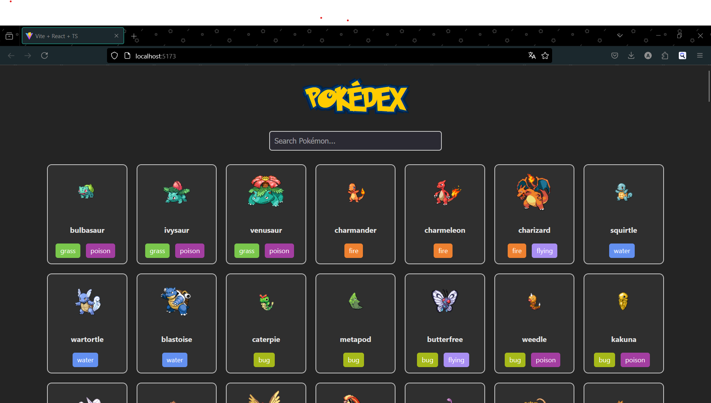

# React Pokedex

A Pokedex web app built with React that allows users to search and explore various Pokémon.



## Features
- Search for Pokémon by name
- View detailed information about each Pokémon, including stats, abilities, and types
- Responsive design

## Getting Started

To get the project up and running locally, follow these steps:

### 1. Clone the repository:

```bash
git clone https://github.com/KonyD/react-pokedex.git
```

### 2. Install dependencies:

Navigate into the project directory and install all dependencies using npm:

```bash
cd react-pokedex
npm install
```

### 3. Start the development server:

```bash
npm run dev
```

This will open the app in your browser at `http://localhost:5173`.

## Acknowledgments
- **[React](https://react.dev/)**: For building the user interface.
- **[Vite](https://vite.dev/)**: For providing a fast and optimized development environment.
- **[Pokemon Solid](https://fonts2u.com/pokemon-solid-normal.font)**: The font used for the title.
- **[Poke API](https://pokeapi.co/)**: The API used to fetch pokemon data.

## License

This project is open-source and available under the [MIT License](LICENSE).
